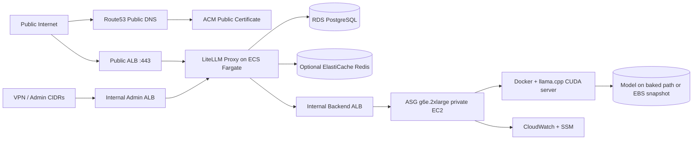

# AWS LLM Hosting Platform

Production-oriented Infrastructure-as-Code repository for hosting a shared developer LLM platform on AWS with:

- Terraform
- Packer
- LiteLLM Proxy
- ECS Fargate frontend
- Internal backend ALB
- Auto Scaling Group of private GPU instances
- `llama.cpp` CUDA server for `unsloth/Qwen3.6-27B-GGUF:UD-Q6_K_XL`

The default deployment target is `eu-north-1` and is sized for roughly 10 developers with a baseline of one `g6e.2xlarge` backend instance and configurable scale-out to 3 or higher.

## Architecture



Traffic flow:

- Public clients use `https://<domain>/v1/*`.
- Optional Anthropic-compatible requests can be routed through `https://<domain>/anthropic/*`.
- LiteLLM Admin UI is exposed only via the internal admin ALB or restricted admin CIDRs.
- Backend GPU instances are private-only and receive traffic only from the internal backend ALB.

## Why This Design

- ECS Fargate keeps the API proxy managed and easy to patch.
- GPU inference stays on EC2 because Fargate does not support the required NVIDIA workload shape.
- Existing VPCs and subnets are accepted as inputs; no new VPC is created unless you explicitly extend the stack.
- The model is expected to be preloaded from an EBS snapshot or AMI path, avoiding repeated large downloads on boot.

## Prerequisites

- AWS account with permissions for Route53, ACM, ECS, EC2, Auto Scaling, ELBv2, IAM, CloudWatch, RDS, Secrets Manager, and SSM
- Existing VPCs and subnet IDs for:
  - frontend public subnets
  - frontend private subnets
  - backend private subnets
- Existing route tables unless `assume_existing_vpc_routing = true`
- Terraform `>= 1.7`
- Packer `>= 1.10`
- AWS CLI v2
- Session Manager plugin if you want interactive SSM shells locally

For recent Debian and Ubuntu operators, bootstrap the local toolchain with:

```bash
./scripts/install-dependencies-debian-ubuntu.sh
```

This installs Terraform, Packer, AWS CLI v2, the Session Manager plugin, and common helper tools using the HashiCorp APT repository plus AWS's official installers.

## Domain Registration and Hosted Zone

Domain registration is intentionally not automated.

1. Register the domain in Route53 Domains or another registrar.
2. If you use Route53 Domains:
   - open the Route53 console
   - register the domain manually
   - wait for registration to complete
3. If `create_route53_zone = true`, Terraform creates the public hosted zone for the domain.
4. If the domain is registered outside AWS:
   - copy the Route53 hosted zone name servers after Terraform creates the zone
   - update the registrar to use those Route53 name servers
5. ACM uses DNS validation records in the hosted zone and Terraform manages those records automatically.

## First Deployment

1. Build the backend AMI or prepare the model EBS snapshot.
2. Copy one of the example `tfvars` files and fill in your VPC, subnet, and domain values.
3. Create required secrets:
   - LiteLLM master key
   - PostgreSQL password if you want to preseed it
4. Run:

```bash
make init
make plan TFVARS=../examples/prod.tfvars
make apply TFVARS=../examples/prod.tfvars
```

5. Wait for:
   - ACM validation to complete
   - ECS service to stabilize
   - backend ASG instances to pass the internal ALB health check
6. Test:

```bash
curl https://your-domain.example/v1/models
```

## Model Storage Strategy

Preferred order:

1. EBS snapshot attached as a dedicated model volume
2. AMI with model copied to local NVMe or EBS-backed filesystem
3. Development-only boot-time download from Hugging Face

Runbooks:

- [docs/model-snapshots.md](/home/csandberg/projects/aws-llm-hosting/docs/model-snapshots.md)
- [docs/operations.md](/home/csandberg/projects/aws-llm-hosting/docs/operations.md)

## Changing llama.cpp Settings

Backend runtime settings live in `/etc/default/llama-server` on each GPU instance and are templated from Terraform variables. The key settings are:

- `LLAMA_ARG_MODEL`
- `LLAMA_ARG_ALIAS`
- `LLAMA_ARG_CTX_SIZE`
- `LLAMA_ARG_PARALLEL`
- `LLAMA_ARG_N_GPU_LAYERS`
- `LLAMA_ARG_TEMP`
- `LLAMA_ARG_TOP_P`
- `LLAMA_ARG_TOP_K`
- `LLAMA_ARG_MIN_P`
- `LLAMA_ARG_REASONING_BUDGET`
- `LLAMA_ARG_HOST`
- `LLAMA_ARG_PORT`

Tradeoffs:

- `parallel = 1`: best per-request latency and highest safety margin for long reasoning prompts
- `parallel = 2`: balanced default for about 10 developers when concurrency is moderate
- `parallel = 4`: better throughput, but increased VRAM pressure and more contention
- larger `ctx-size`: more context per request, but lower throughput and more memory pressure
- higher `reasoning-budget`: better deeper reasoning behavior, but longer tail latency

Default recommendations for `Qwen3.6-27B UD-Q6_K_XL` on `g6e.2xlarge` are baked into `examples/` and can be overridden via `llama_cpp_settings`.

## Switching Models

1. Prepare a new model volume snapshot or a new AMI.
2. Update:
   - `model_repo`
   - `model_filename`
   - `model_alias`
   - `model_path`
   - `model_ebs_snapshot_id` or `backend_ami_id`
3. Apply Terraform.
4. Start an ASG instance refresh if one is not triggered automatically.
5. Validate `/health` and a small completion request.

## Upgrading llama.cpp

Change:

- `llama_cpp_image`
- `llama_cpp_image_tag`

Then:

1. `terraform apply`
2. Start or confirm ASG instance refresh
3. Watch CloudWatch logs and target health
4. Roll back by restoring the previous image tag and refreshing again

Optional workflow:

- [`.github/workflows/backend-rollout.yml`](/home/csandberg/projects/aws-llm-hosting/.github/workflows/backend-rollout.yml)

## Rolling the ASG

Use either:

- Terraform launch template changes
- `aws autoscaling start-instance-refresh`

The helper script is:

- [scripts/start-instance-refresh.sh](/home/csandberg/projects/aws-llm-hosting/scripts/start-instance-refresh.sh)

## Rollback

Fastest rollback path:

1. restore the previous `llama_cpp_image_tag`, AMI, or snapshot ID
2. `terraform apply`
3. start a fresh ASG instance refresh
4. confirm target health and a smoke test response

## LiteLLM Developer Keys and Admin Access

- LiteLLM uses PostgreSQL for persistent users, keys, and budgets.
- Generate developer keys through the admin interface or LiteLLM admin APIs after connecting through the internal admin ALB.
- Budget defaults are intentionally generous and easy to tune later in the frontend module.

Internal admin access:

- prefer VPN, Direct Connect, or peered corporate networks
- otherwise restrict `admin_allowed_cidrs`

## SSM Session Manager

Backend instances include the SSM managed instance role and do not require public IPs.

Example:

```bash
aws ssm start-session --target i-0123456789abcdef0
```

## Optional SSH

SSH is disabled by default.

To enable it:

1. set `enable_ssh_access = true`
2. set `ssh_key_name`
3. set `ssh_allowed_cidrs`
4. apply Terraform

Use this sparingly; SSM remains the preferred access path.

## Observability

Included:

- CloudWatch log groups for LiteLLM, backend bootstrap, Docker, and `llama.cpp`
- dashboards for ALB, ASG, ECS, and GPU metrics
- alarms for unhealthy targets, high 5xx rate, elevated latency, high GPU memory use, and ASG capacity issues

## Formatting and Validation

```bash
make fmt
make validate
```

Recommended extras:

- `terraform-docs`
- `tflint`
- `checkov`

## Troubleshooting

- ACM stuck in validation:
  - confirm the public hosted zone is authoritative for the domain
- ECS service unhealthy:
  - inspect CloudWatch logs for the LiteLLM task
  - verify DB connectivity and Secrets Manager access
- backend instances unhealthy:
  - inspect `/var/log/cloud-init-output.log`
  - inspect `journalctl -u llama-server`
  - confirm the model path exists and the EBS snapshot was attached correctly
- slow responses:
  - reduce `LLAMA_ARG_CTX_SIZE`
  - reduce `LLAMA_ARG_REASONING_BUDGET`
  - lower `LLAMA_ARG_PARALLEL`
  - scale out the ASG
