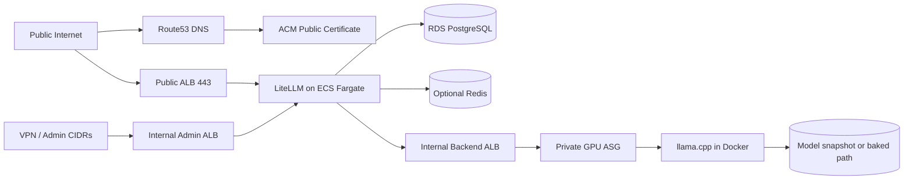

# AWS LLM Hosting Platform

Production-ready Infrastructure-as-Code for running a shared internal LLM platform on AWS.

This repository provisions a public `/v1` API through LiteLLM, routes requests to private GPU-backed `llama.cpp` workers, and is designed around existing VPCs, repeatable operations, and safe cleanup defaults.

Repository status:

- Ready for GitHub publication
- Operator-focused quickstart and runbooks are in place
- Terraform and Packer validation pass in the current repo state

Main components:

- Terraform
- Packer
- LiteLLM Proxy
- ECS Fargate frontend
- Internal backend ALB
- Auto Scaling Group of private GPU instances
- `llama.cpp` CUDA server for `unsloth/Qwen3.6-35B-A3B-GGUF:UD-Q6_K_XL`

The default target is `eu-north-1` and the baseline shape is one private `g6e.2xlarge` backend instance, suitable for roughly 10 developers with configurable scale-out.

## What This Repo Deploys

Architecture summary:



Supported public API contract:

- Public clients use `https://<domain>/v1/*`
- LiteLLM Admin UI is internal-only or CIDR-restricted
- Anthropic-native ingress is not guaranteed by default

Core assumptions:

- existing VPCs and subnets are supplied as Terraform inputs
- backend EC2 instances stay private-only
- SSM Session Manager is the default access path
- model assets are prepared outside Terraform and then attached or referenced

For deeper design rationale and network assumptions, see [docs/architecture.md](docs/architecture.md).

## Before You Start

Prerequisites:

- AWS account with permissions for Route53, ACM, ECS, EC2, Auto Scaling, ELBv2, IAM, CloudWatch, RDS, Secrets Manager, and SSM
- Existing VPCs and subnet IDs for:
  - frontend public subnets
  - frontend private subnets
  - backend private subnets
- Existing route tables unless `assume_existing_vpc_routing = true`
- Terraform `>= 1.7`
- Packer `>= 1.10`
- AWS CLI v2
- Session Manager plugin for SSM shell access

Install local tooling:

```bash
./scripts/install-dependencies-debian-ubuntu.sh
```

Check AWS access:

```bash
./scripts/aws-preflight.sh --region eu-north-1
```

For detailed AWS discovery, readiness, and tfvars generation steps, see [docs/aws-cli-workflow.md](docs/aws-cli-workflow.md).

## Initial Setup

Follow this sequence top-to-bottom for the first deployment.

### 1. Install local dependencies

Purpose: install Terraform, Packer, AWS CLI v2, Session Manager plugin, and helper tools.

```bash
./scripts/install-dependencies-debian-ubuntu.sh
```

Success signal: the script prints installed versions for Terraform, Packer, AWS CLI, and the Session Manager plugin.

### 2. Run AWS preflight

Purpose: verify the active AWS identity, region, service access, and GPU instance availability.

```bash
./scripts/aws-preflight.sh --region eu-north-1
```

Success signal: the output ends with `Fail : 0`.

At this stage, keep the preflight focused on AWS identity, region, and service access:

```bash
./scripts/aws-preflight.sh --region eu-north-1
```

You can run the deeper domain, hosted zone, and VPC-aware checks later as part of the readiness report flow.

Before the Packer AMI build, you can also run a deeper permission check against the exact Packer inputs:

```bash
./scripts/aws-preflight.sh \
  --region eu-north-1 \
  --packer-vars-file packer/backend.auto.pkrvars.hcl
```

That check can catch common launch-permission problems such as denied `ec2:RunInstances` access for the selected subnet, instance type, security group, or source AMI.

More detail: [docs/aws-cli-workflow.md](docs/aws-cli-workflow.md).

### 3. Inspect VPC inputs

Purpose: confirm subnet roles and route tables for the existing frontend and backend VPCs.

Inspect a VPC:

```bash
./scripts/discover-vpc-details.sh \
  --region eu-north-1 \
  --vpc-id vpc-0123456789abcdef0 | jq
```

Success signal: you understand which subnets and route tables will be used for frontend and backend deployment.

More detail: [docs/aws-cli-workflow.md](docs/aws-cli-workflow.md).

### 4. Register the domain and set up the hosted zone

Purpose: make sure Terraform can request an ACM certificate and create DNS validation records.

Manual steps:

1. Register the domain in Route53 Domains or another registrar.
2. If `create_route53_zone = true`, Terraform will create the public hosted zone.
3. If the domain is registered outside AWS, update the registrar name servers after the hosted zone exists.
4. Do not manually create the final app host record such as `llm.example.com`. Terraform creates that Route53 alias record for `domain_name` and points it at the public ALB.

Success signal: the domain exists, and either:

- you know the target `route53_zone_id`, or
- you plan to set `create_route53_zone = true`

Detailed guide for first-time Route53 users:

- [docs/route53-domain-setup.md](docs/route53-domain-setup.md)

### 5. Generate a readiness report

Purpose: create a shareable Markdown summary of AWS access, DNS readiness, and VPC shape.

```bash
./scripts/aws-readiness-report.sh \
  --region eu-north-1 \
  --domain-name llm.example.com \
  --route53-zone-id Z1234567890EXAMPLE \
  --frontend-vpc-id vpc-frontend123 \
  --backend-vpc-id vpc-backend123 \
  --output docs/readiness-report.md
```

Success signal: the script writes `docs/readiness-report.md`.

Important notes when reading the report:

- A warning like `no exact hosted zone found for llm.example.com` is expected if your hosted zone is the parent domain such as `example.com`. Terraform will create the final `llm.example.com` record later.
- A warning about backend public subnets is informational in a shared-VPC design. It is safe as long as `backend_private_subnet_ids` only reference private subnets and the backend instances do not receive public IPs.

### 6. Generate a starter tfvars file

Purpose: create a deployment config that includes your existing VPC inputs and known DNS values.

```bash
./scripts/generate-existing-vpc-tfvars.sh \
  --region eu-north-1 \
  --frontend-vpc-id vpc-frontend123 \
  --backend-vpc-id vpc-backend123 \
  --project-name llm-hosting \
  --environment prod \
  --domain-name llm.example.com \
  --route53-zone-id Z1234567890EXAMPLE > examples/generated.prod.tfvars
```

Success signal: `examples/generated.prod.tfvars` exists and contains your VPC, subnet, route table, and domain inputs.

More detail: [docs/aws-cli-workflow.md](docs/aws-cli-workflow.md).

### 7. Create the LiteLLM master key if Terraform will not generate it

Purpose: prepare the admin/master key outside Terraform when you want explicit secret ownership.

```bash
./scripts/create-litellm-secret.sh \
  --region eu-north-1 \
  --name llm-hosting/prod/litellm-master-key
```

If you do this, set these in your `tfvars`:

- `create_litellm_master_key_secret = false`
- `existing_litellm_master_key_secret_arn = "arn:..."`

Success signal: the secret exists in Secrets Manager.

More detail: [docs/aws-cli-workflow.md](docs/aws-cli-workflow.md).

### 8. Build the backend AMI

Purpose: create the GPU-ready backend image with Docker, NVIDIA runtime, systemd units, and CloudWatch agent installed.

Prepare the Packer build inputs from the Terraform file you generated earlier:

```bash
./scripts/prepare-packer-build.sh \
  --region eu-north-1 \
  --tfvars examples/generated.prod.tfvars \
  --pkrvars-out packer/backend.auto.pkrvars.hcl

make packer-init
packer validate -var-file=packer/backend.auto.pkrvars.hcl packer/backend-ami.pkr.hcl
make packer-build PACKER_VARS=backend.auto.pkrvars.hcl
```

This helper:

- picks the first subnet from `backend_private_subnet_ids` for `subnet_id`
- creates a temporary security group in `backend_vpc_id` for `security_group_id`
- writes `packer/backend.auto.pkrvars.hcl`

Important:

- the Packer build now connects through AWS Session Manager, so the temporary security group does not need inbound SSH
- the chosen backend private subnet still needs outbound access to SSM and package repositories, either through NAT or the required VPC endpoints
- the Packer launch now explicitly requires IMDSv2 and an encrypted `gp3` root volume
- the Packer template now uses a longer AWS waiter by default, with roughly 90 minutes available for slow AMI snapshot finalization
- the AMI bake now prunes package caches, transient logs, and temporary provisioning files before snapshot creation to reduce image bloat
- if your organization requires a customer-managed KMS key for EBS encryption, add `root_volume_kms_key_id` to `packer/backend.auto.pkrvars.hcl`
- if you want to use a different backend private subnet, pass `--subnet-id subnet-...`
- if your AWS account blocks temporary Packer roles or `iam:PassRole`, create a reusable instance profile and add it to the generated vars file:
- `make packer-build` now shows `[ami-progress]` lines after the AMI ID is created, including backing snapshot progress from AWS
- unchanged progress is collapsed so you only see progress changes plus an occasional heartbeat on long waits
- if your environment still needs a longer waiter, uncomment `aws_poll_delay_seconds` and `aws_max_attempts` in `packer/backend.auto.pkrvars.hcl`

```bash
./scripts/create-packer-instance-profile.sh \
  --region eu-north-1 \
  --name llm-packer-builder
```

Then either set `packer_instance_profile_name = "llm-packer-builder"` manually in `packer/backend.auto.pkrvars.hcl`, or regenerate the file with:

```bash
./scripts/prepare-packer-build.sh \
  --region eu-north-1 \
  --tfvars examples/generated.prod.tfvars \
  --packer-instance-profile-name llm-packer-builder \
  --pkrvars-out packer/backend.auto.pkrvars.hcl
```

Success signal: the helper prints a security group ID and Packer vars file path, then Packer outputs a new AMI ID and writes `packer/manifest.json`.

### 9. Create the model snapshot

Purpose: prepare the model volume snapshot used by backend instances in production.

Create a local Hugging Face config file from the example if needed:

```bash
cp examples/huggingface.env.example .hf.env
```

Run the orchestration helper from your local machine:

```bash
./scripts/run-model-snapshot-job.sh \
  --region eu-north-1 \
  --tfvars examples/generated.prod.tfvars \
  --config ./.hf.env
```

Success signal: the script prints a completed `snap-...` ID and updates `examples/generated.prod.tfvars` with `model_ebs_snapshot_id`.

Important:

- the script launches a temporary helper EC2 instance in the first backend private subnet, prepares the model volume over SSM, snapshots it, updates your tfvars locally, and then terminates the helper instance
- by default it uses a small temporary helper instance and a `100` GiB encrypted `gp3` model volume, which is a reasonable starting point for the default model
- if the reusable helper instance profile does not exist, the script creates `llm-model-snapshot-helper` automatically using the same SSM-only pattern as the Packer helper profile
- it reads `HF_TOKEN` from the shell environment or a `--config` file when needed
- the EBS snapshot description is generated automatically from the configured model by default; set `SNAPSHOT_DESCRIPTION` in your config only if you want to override it
- `./scripts/update-model-snapshot.sh` remains available as an advanced/manual fallback when you intentionally want to run the workflow from inside an EC2 helper instance yourself

More detail: [docs/model-snapshots.md](docs/model-snapshots.md).

### 10. Fill in the deployment tfvars file

Purpose: combine discovered network inputs, image artifacts, DNS, and secrets into one deployment config.

Edit:

- `examples/generated.prod.tfvars`

Fill in at least:

- `backend_ami_id`
- `model_ebs_snapshot_id`
- `route53_zone_id` or `create_route53_zone = true`
- `admin_allowed_cidrs`
- any environment-specific overrides

If you want a quick suggestion for `admin_allowed_cidrs`, run:

```bash
./scripts/suggest-admin-cidrs.sh \
  --region eu-north-1 \
  --tfvars examples/generated.prod.tfvars
```

Use the suggested public `/32` as the default choice unless you intentionally want to allow a private/VPN CIDR instead.

Success signal: the file contains no placeholder AMI or snapshot IDs.

### 11. Run Terraform

Purpose: create the managed infrastructure for the deployment.

```bash
make init
make plan TFVARS=examples/generated.prod.tfvars
make apply TFVARS=examples/generated.prod.tfvars
```

Success signal: Terraform completes successfully and prints outputs, including the public API endpoint and internal ALB names.

### 12. Wait for the platform to become healthy

Purpose: confirm ACM, ECS, and the backend ASG all stabilize before testing clients.

Wait for:

- ACM validation to complete
- ECS service tasks to become healthy
- backend ASG instances to pass the internal ALB `/health` check

Optional backend check:

```bash
./scripts/check-backend-health.sh internal-backend-alb-123.eu-north-1.elb.amazonaws.com
```

Success signal: the backend health endpoint returns HTTP 200 and the ECS service stays stable.

### 13. Test the public endpoint

Purpose: confirm the public LiteLLM API is reachable.

```bash
curl https://your-domain.example/v1/models
```

Success signal: you get a valid JSON response from the public `/v1` endpoint.

Use OpenAI-compatible clients against the public endpoint by default.

## Common Tasks After Deployment

Use this as the quick index for later tasks.

| Task | Primary entrypoint | Details |
|---|---|---|
| Check environment readiness | `./scripts/aws-readiness-report.sh` | [docs/aws-cli-workflow.md](docs/aws-cli-workflow.md) |
| Create deployment tfvars from existing VPCs | `./scripts/generate-existing-vpc-tfvars.sh` | [docs/aws-cli-workflow.md](docs/aws-cli-workflow.md) |
| Build or update model snapshot | `./scripts/run-model-snapshot-job.sh` | [docs/model-snapshots.md](docs/model-snapshots.md) |
| Access the internal admin UI | internal admin ALB output | [docs/operations.md](docs/operations.md) |
| Add or rotate LiteLLM keys/secrets | `create-litellm-secret.sh` or admin UI | [docs/operations.md](docs/operations.md) |
| Change llama.cpp settings | edit `llama_cpp_settings` and apply | [docs/operations.md](docs/operations.md) |
| Switch models | snapshot/model variable update | [docs/model-snapshots.md](docs/model-snapshots.md) |
| Refresh or roll backend instances | `./scripts/start-instance-refresh.sh` | [docs/operations.md](docs/operations.md) |
| Upgrade llama.cpp | update image tag and apply | [docs/operations.md](docs/operations.md) |
| Roll back | restore previous values and refresh | [docs/operations.md](docs/operations.md) |
| Clean up safely | `make cleanup` or `cleanup-deployment.sh` (also removes Packer AMIs from `packer/manifest.json` and tagged Packer build SGs by default) | [docs/operations.md](docs/operations.md) |
| Use SSM or optionally SSH | `aws ssm start-session` | [docs/operations.md](docs/operations.md) |
| Validate and format | `make fmt`, `make validate` | [docs/operations.md](docs/operations.md) |

## Troubleshooting

Keep these checks in mind during first deployment:

- `aws-preflight.sh` shows failures:
  - fix AWS auth, region config, or missing service permissions first
- ACM validation does not complete:
  - verify the public hosted zone is authoritative for the domain
- ECS service does not stabilize:
  - inspect LiteLLM CloudWatch logs and verify DB/secret access
- Backend targets stay unhealthy:
  - check `/var/log/cloud-init-output.log`, `journalctl -u llama-server`, and the model path
- Public `/v1/models` does not respond:
  - confirm DNS points at the public ALB and backend health is green
- Packer or Terraform validation fails:
  - rerun `make validate` and fix the first reported error

For deeper runbooks:

- [docs/aws-cli-workflow.md](docs/aws-cli-workflow.md)
- [docs/model-snapshots.md](docs/model-snapshots.md)
- [docs/operations.md](docs/operations.md)
- [docs/architecture.md](docs/architecture.md)
